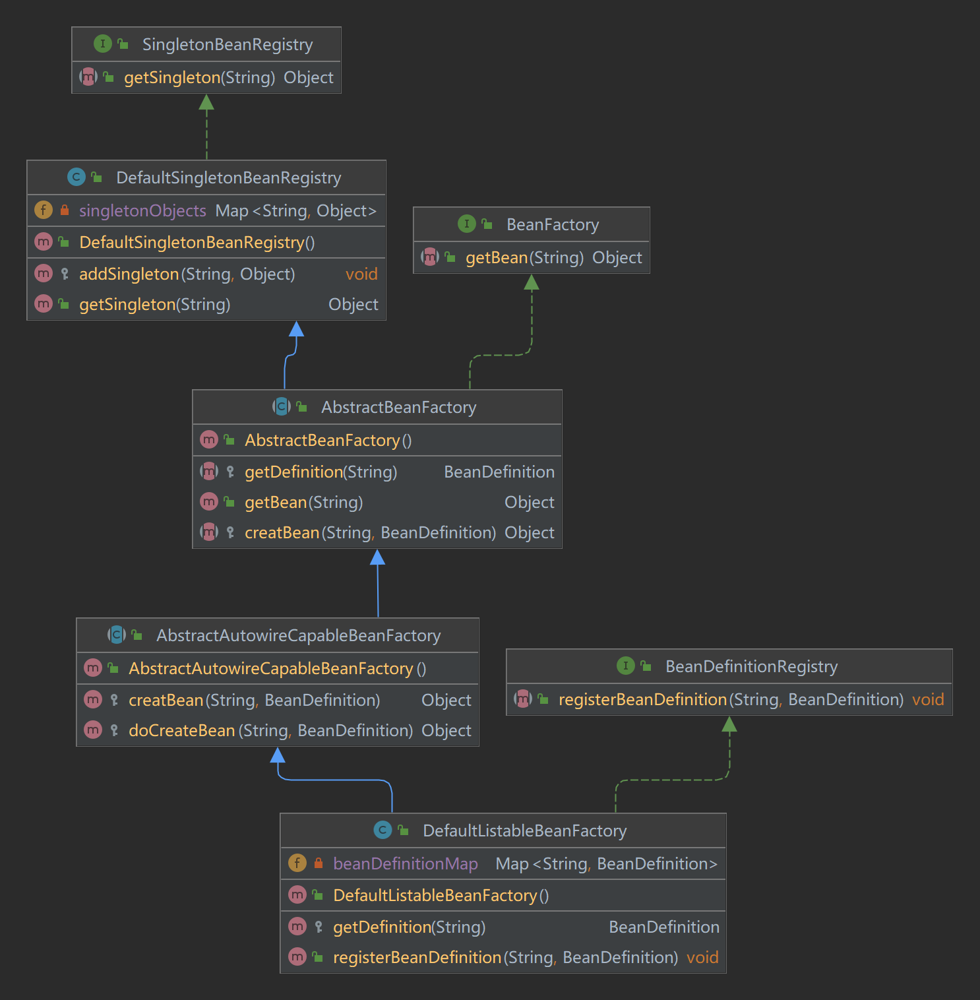

1. 与simple-bean-container的区别：把Bean的创建交给容器，而不是在调用的时候传递一个实例化好的Bean对象
2. 上一版本：```
BeanFactory beanFactory = new BeanFactory();
beanFactory.registerBean("helloService", new HelloService())```
3. 这一版本：```
BeanDefinition beanDefinition = new BeanDefinition(HelloService.class);
beanFactory.registerBeanDefinition("helloService",beanDefinition);```
4. 单例模式只涉及一个类，确保在系统中一个类只有一个实例，并提供一个全局访问入口
5. 因为抽象类本身被设计成只能用于被继承，因此，抽象类可以强迫子类实现其定义的抽象方法，否则编译会报错。因此，抽象方法实际上相当于定义了“规范”。
6. 面向抽象编程的本质就是：上层代码只定义规范（例如：abstract class Person）； 不需要子类就可以实现业务逻辑（正常编译）；具体的业务逻辑由不同的子类实现，调用者并不关心。
7. BeanFactory是一种容器，其核心职责 
   1. 业务对象间的依赖绑定：判断把谁注入到需要注入的对象，即各个对象之间依赖的关系。 
   2. 业务对象的构建管理：由容器创建对象
8. 